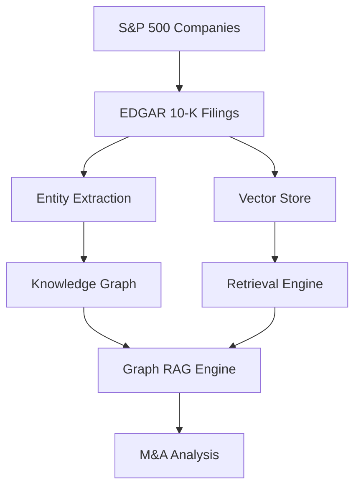

# Financial Graph RAG 

## M&A Organizational Structure Analysis using Knowledge Graphs

A sophisticated Graph RAG (Retrieval-Augmented Generation) system for analyzing mergers & acquisitions impact on organizational structure using SEC 10-K filings from S&P 500 companies.

  

### 🎯 Research Objective

This system addresses the challenging problem of understanding how mergers and acquisitions impact internal organizational structures of large corporations. Traditional analysis of 10-K filings is difficult due to:

- **Unstructured data**: M&A information is scattered across lengthy documents
- **Complex relationships**: Multiple entities, subsidiaries, and organizational changes
- **Temporal evolution**: Organizational changes occur over time
- **Scale**: Analyzing hundreds of companies manually is infeasible

### 🏗️ System Architecture

Based on the Graph RAG approach described in [Microsoft's Graph RAG paper](https://arxiv.org/pdf/2504.14493v2), our system combines:

1. **Knowledge Graph Construction**: Extracts entities (companies, executives, transactions) and relationships from 10-K filings
2. **Vector Retrieval**: Semantic search across financial documents using embeddings
3. **Graph-Enhanced Generation**: LLM analysis combining structured graph data with retrieved documents



### 🚀 Quick Start

#### Prerequisites

1. **Neo4j Database** (for knowledge graph storage)
   ```bash
   # Using Docker
   docker run -p 7474:7474 -p 7687:7687 -e NEO4J_AUTH=neo4j/password neo4j:latest
   ```

2. **Ollama** (for local LLM - Default option)
   ```bash
   # Install Ollama
   curl -fsSL https://ollama.ai/install.sh | sh
   
   # Pull Gemma 3 27B model
   ollama pull gemma3:27b
   
   # Start Ollama server (uses OpenAI API format on port 11434)
   ollama serve
   ```

3. **API Keys** (optional - only needed if using cloud providers)
   ```bash
   # For Ollama (local) - Default configuration
   OPENAI_API_KEY=ollama-local
   OPENAI_BASE_URL=http://localhost:11434/v1
   
   # For OpenAI (cloud - optional)
   OPENAI_API_KEY=your_openai_key
   OPENAI_BASE_URL=https://api.openai.com/v1
   
   # For Anthropic (cloud - optional)
   ANTHROPIC_API_KEY=your_anthropic_key
   ```

#### Installation

```bash
# Clone the repository (assuming you're in the openedgar directory)
cd financial_graph_rag

# Install dependencies
pip install -r requirements.txt

# Set up environment variables
cp .env.example .env
# Edit .env with your API keys and database settings
```

#### Basic Usage

1. **Setup the data pipeline**:
   ```bash
   python -m financial_graph_rag.cli setup --years 2022 --years 2023 --limit-companies 10
   ```

2. **Analyze a specific company**:
   ```bash
   python -m financial_graph_rag.cli analyze MSFT --focus "subsidiary integration"
   ```

3. **Check system status**:
   ```bash
   python -m financial_graph_rag.cli status
   ```

### 📊 Research Capabilities

#### 1. Company-Specific M&A Analysis

Analyze how mergers and acquisitions impact a company's organizational structure:

```python
from financial_graph_rag import FinancialGraphRAG

system = FinancialGraphRAG()

# Analyze Microsoft's organizational changes
results = system.analyze_company_ma_impact(
    company_ticker="MSFT",
    analysis_focus="subsidiary integration strategies",
    years=[2022, 2023]
)

print(results['analysis'])
```

**Sample Analysis Output**:
```
M&A Activity Summary:
- Microsoft completed acquisition of Activision Blizzard for $68.7B in 2023
- Strategic focus on gaming and metaverse capabilities

Organizational Structure Impact:
- Created new Gaming division under CEO Phil Spencer
- Integrated 10,000+ employees from Activision
- Maintained separate subsidiary structure for King Digital Entertainment

Integration Challenges & Synergies:
- Regulatory approval delays impacted timeline
- Cultural integration challenges between gaming and enterprise cultures
- Expected $1B+ annual synergies from combined gaming ecosystem
```

#### 2. Sector-Wide M&A Trends

Analyze M&A patterns across industries:

```bash
python -m financial_graph_rag.cli trends --sector "Information Technology" --years 2022 --years 2023
```

#### 3. Comparative M&A Analysis

Find companies with similar M&A organizational patterns:

```bash
python -m financial_graph_rag.cli similar AAPL --criteria "vertical integration strategies"
```

#### 4. Custom Research Queries

Run natural language queries across the knowledge base:

```bash
python -m financial_graph_rag.cli query "How do pharmaceutical companies restructure after major acquisitions?" --company PFE
```

### 🔬 Research Methodology

#### Data Collection
- **S&P 500 Companies**: Current list with CIK numbers from SEC
- **10-K Filings**: Annual reports from EDGAR database (2020-2023)
- **M&A Focus**: Filings filtered for merger/acquisition keywords

#### Knowledge Graph Schema

**Entities**:
- `Company`: S&P 500 companies with financial metrics
- `Transaction`: M&A deals with values, dates, rationale
- `Person`: Executives and board members
- `Subsidiary`: Subsidiary companies and ownership
- `Division`: Business units and segments
- `Location`: Geographical presence

**Relationships**:
- `acquired`, `merged_with`, `divested`
- `subsidiary_of`, `parent_of`, `owns`
- `ceo_of`, `executive_of`, `reports_to`
- `located_in`, `headquartered_in`

#### Analysis Framework

1. **Temporal Analysis**: Track organizational changes over time
2. **Structural Analysis**: Map corporate hierarchy evolution
3. **Impact Assessment**: Measure integration success/challenges
4. **Comparative Analysis**: Benchmark against industry peers

### 📈 Example Research Questions

The system can help answer questions such as:

1. **Organizational Impact**: "How did Disney's acquisition of Fox affect its media division structure?"

2. **Integration Strategies**: "What are the common patterns in how tech companies integrate AI startups?"

3. **Temporal Evolution**: "How has Amazon's subsidiary structure evolved through its major acquisitions?"

4. **Sector Comparison**: "Do healthcare M&As show different organizational patterns than tech M&As?"

5. **Success Factors**: "What organizational factors correlate with successful M&A integration?"

### 🛠️ Configuration

Key configuration options in `financial_graph_rag/config.py`:

```python
# LLM Configuration (Ollama with OpenAI API format - Default)
OPENAI_API_KEY = "ollama-local"
OPENAI_BASE_URL = "http://localhost:11434/v1"
DEFAULT_LLM_PROVIDER = "openai"
DEFAULT_LLM_MODEL = "gemma3:27b"

# For cloud providers (optional)
# OPENAI_API_KEY = "your_actual_openai_key"
# OPENAI_BASE_URL = "https://api.openai.com/v1"
# DEFAULT_LLM_MODEL = "gpt-4-turbo-preview"

# Database Configuration
NEO4J_URI = "bolt://localhost:7687"
CHROMA_PERSIST_DIRECTORY = "./chroma_db"

# Analysis Parameters
CHUNK_SIZE = 1000
MA_KEYWORDS = ["merger", "acquisition", "subsidiary", "divestiture"]
```

### 📊 System Status Dashboard

Monitor your system's data coverage:

```bash
python -m financial_graph_rag.cli status
```

**Sample Output**:
```
📊 Financial Graph RAG System Status
========================================

📈 S&P 500 Data:
  Total companies: 503
  Companies with CIK: 498
  Sectors: 11

📄 EDGAR Filings:
  Total filings: 1,247
  M&A relevant filings: 342
  Companies covered: 487

🕸️ Knowledge Graph:
  Total nodes: 15,432
  Relationships: 8,921

🗃️ Vector Store:
  Documents: 342
  Collection: financial_documents
```

### 🔍 Advanced Usage

#### Programmatic Access

```python
from financial_graph_rag import FinancialGraphRAG

# Initialize system
system = FinancialGraphRAG()

# Setup data pipeline for specific subset
results = system.setup_data_pipeline(
    years=[2022, 2023],
    limit_companies=50,  # Focus on top 50 companies
    limit_filings_per_company=2
)

# Analyze M&A trends in healthcare
healthcare_trends = system.get_ma_trends_analysis(
    sector="Health Care",
    years=[2022, 2023]
)

# Find similar M&A strategies
similar_cases = system.search_similar_ma_cases(
    reference_company="JNJ",
    similarity_criteria="pharmaceutical acquisition integration"
)

# Export analysis
system.export_analysis_report(
    healthcare_trends, 
    "healthcare_ma_analysis.json",
    format="json"
)

system.close()
```

#### Custom Graph Queries

```python
# Direct graph database access
from financial_graph_rag.knowledge_graph import GraphDatabaseManager

graph_db = GraphDatabaseManager()

# Custom Cypher query
results = graph_db.execute_custom_query("""
    MATCH (c:Company)-[r:RELATED]->(t:Transaction)
    WHERE r.type = 'acquired' 
    AND t.transaction_value > 1000000000
    RETURN c.name, t.name, t.transaction_value
    ORDER BY t.transaction_value DESC
    LIMIT 10
""")

print("Top 10 Largest Acquisitions:")
for result in results:
    print(f"{result['c.name']} acquired {result['t.name']} for ${result['t.transaction_value']/1e9:.1f}B")
```

### 🎓 Research Applications

#### Academic Research
- **Corporate Strategy**: M&A integration strategies and success factors
- **Organizational Theory**: How acquisitions reshape corporate structures
- **Financial Economics**: Market reactions to organizational changes

#### Industry Analysis
- **Investment Banking**: Due diligence and integration planning
- **Management Consulting**: Post-merger integration strategies
- **Corporate Development**: Benchmarking and best practices

#### Policy Research
- **Antitrust Analysis**: Market concentration and competitive effects
- **Regulatory Impact**: How regulations affect M&A structures

### 🔧 Troubleshooting

#### Common Issues

1. **Neo4j Connection Error**:
   ```bash
   # Check if Neo4j is running
   docker ps | grep neo4j
   
   # Restart if needed
   docker restart <neo4j_container_id>
   ```

2. **OpenAI Rate Limits**:
   ```python
   # Adjust rate limiting in config.py
   LLM_RATE_LIMIT = 2.0  # Increase delay between requests
   ```

3. **Memory Issues with Large Datasets**:
   ```bash
   # Process in smaller batches
   python -m financial_graph_rag.cli setup --limit-companies 25 --limit-filings 1
   ```

4. **Missing CIK Numbers**:
   ```python
   # Check companies with missing CIKs
   collector = SP500Collector()
   companies = collector.collect_all()
   missing_cik = [c for c in companies if not c.cik]
   print(f"Companies missing CIK: {len(missing_cik)}")
   ```

### 📚 References

1. [Graph RAG: Unlocking LLM discovery on narrative private data](https://arxiv.org/pdf/2504.14493v2) - Microsoft Research
2. [SEC EDGAR Database](https://www.sec.gov/edgar) - Primary data source
3. [Neo4j Graph Database](https://neo4j.com/) - Knowledge graph storage
4. [LangChain](https://langchain.com/) - LLM orchestration framework

### 🤝 Contributing

This research tool is designed for academic and research purposes. Contributions welcome:

1. **Data Collectors**: Additional SEC forms (8-K, proxy statements)
2. **Analysis Modules**: Industry-specific analysis patterns
3. **Visualization**: Graph visualization and analysis dashboards
4. **Evaluation**: Metrics for measuring analysis quality

### 📄 License

MIT License - See LICENSE file for details.

### ⚠️ Disclaimer

This tool is for research and educational purposes. Always verify findings with original SEC filings. Not intended for investment advice or commercial use without proper compliance review.

---

**Built with ❤️ for M&A Research**

*Enabling data-driven insights into corporate organizational evolution* 